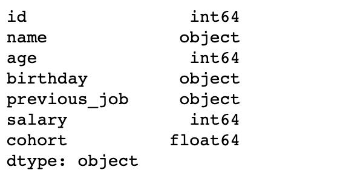
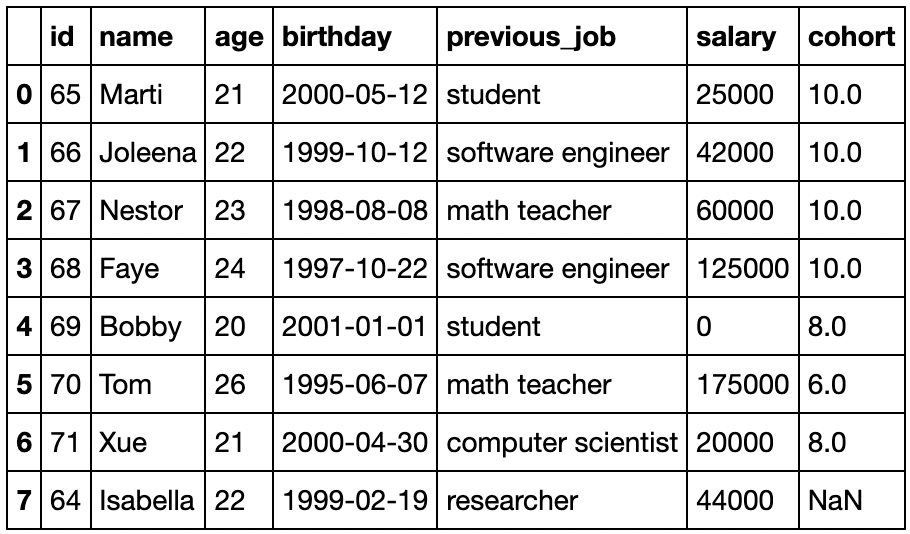
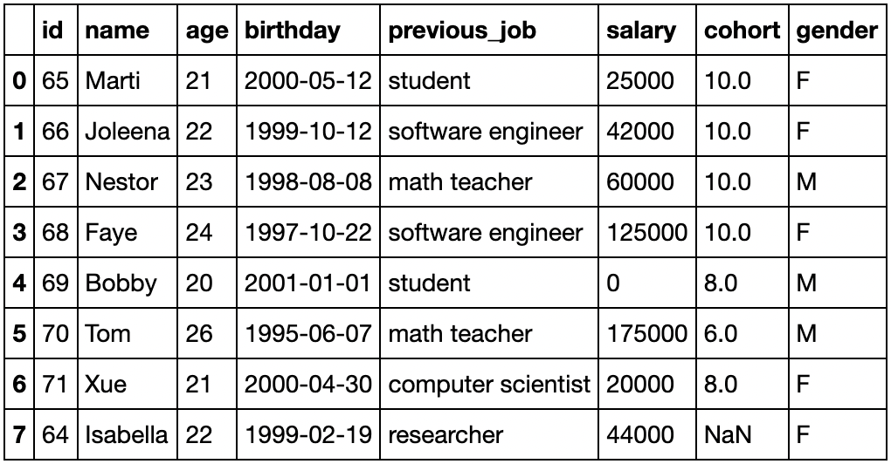
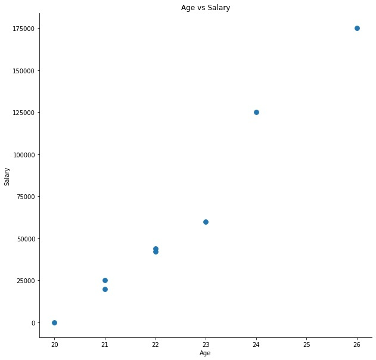
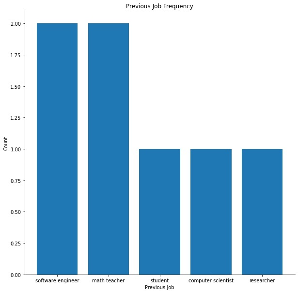
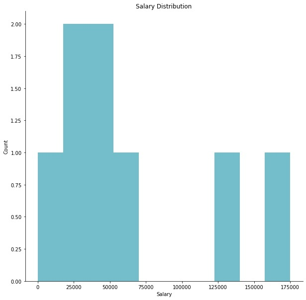

# Exploratory Data Analysis (EDA) using Pandas

**By**: Marti Heit, Joleena Marshall, Faye Pei, and Nestor Teodoro Chavez.

## Motivation
Exploratory Data Analysis (EDA) is one of the most important steps in solving data science problems, considering it takes up 90% of what data scientists do day-to-day. Without using the appropriate cleaned data, the inferences or predictions that are made can be misleading and unreliable. EDA is the process of exploring and cleaning our data to find trends that we can keep in mind, or resolve any issues that the data may cause, so that we can choose the most appropriate model that will provide is with the best results to answer our research questions. With a multitide to different tools we can use to conduct EDA, the best solution is to use a tool that has all the functionality we need with one library. Our goal is to display how `Pandas`, a software library written for Python, is a great choice for data manipulation and analysis. Pandas will help you explore, clean, and process your data so that it is ready for modeling or to make inferences.

## The Description

old comment: <Pandas handles data acquisition really well. Pandas is able to import   `xml`,`json`,`csv`,`xls`,and `html`.>

Here, we will explain the significance of the four steps of EDA using Pandas:<br>
1. [Data Acquisition](#import)<br>
2. [Data Exploration](#explore)<br>
3. [Data Preprocessing](#preprocess)
4. [Visualization](#viz)<br>

## Getting Started 

Download the [eda-code.ipynb](https://github.com/neteodorochavez/msds610-eda-pandas/blob/main/EDA-Code.ipynb). Next, download the [data](https://github.com/neteodorochavez/msds610-eda-pandas/tree/main/data). If you'd like to use other datasets, make sure to add them into the data folder. The filetypes of choice have a wide range.

## Installation

```
pip install --upgrade pip
pip install pandas
pip install numpy
pip install matplotlib
```

## Our Process

### Benefits of Pandas Library (Joleena)

Python's Pandas library is a powerful tool for EDA because of its flexibility with data manipulation using its provided functions, as well as its compatability with other commonly-used Python packages in data science such as scipy, numpy, and matplotlib. Pandas provides an organized and easy-to-read [documentation](https://pandas.pydata.org/pandas-docs/stable/reference/index.html) to help teach you how to use its different functions. In pandas, a data table is referred to as `DataFrame`. 

### <a name="import">Importing Data</a> (Joleena)

To begin EDA, the first step is to acquire the data you need. The internet, and other data sources, consists of data in different formats such as XML, HTML, JSON, and CSV. To help make the data more readable and easier to work with, Pandas provides functions to convert these filetypes into dataframes with a simple line of code. This way, we can combine data from different formats into one. With a working dataframe, we can clearly see every record without the learning curve of learning how to read different source code. Here are a few examples:
- XML file to a readable data frame using `pd.read_xml(<filepath>)`
- | XML | Pandas Data Frame|
|   |    |


<p float="left">
  
  
</p>

- JSON file to a readable data frame using `pd.read_json(<filepath>)`
<p float="left">
  
  
</p>

- HTML file to a readable data frame using `pd.read_html(<filepath>)`
<p float="left">
  

</p>

- CSV file to a data frame using `pd.read_csv(<filepath>)` (This is useful when aggregating with data from other filetypes or to use Pandas to preprocess data)
<p float="left">
  


</p>

### <a name="explore">Data Exploration</a> (Marti)
#### Manipulating Data Frame

### <a name="preprocess">Preprocessing</a>

Preprocessing is the stage in EDA that explores the data and ensures its integrity. In other words, it makes sure that the dataset is properly formatted in order to continue with the next step of the process. Oftentimes this stage deals with missing or misleading data, creating better features (columns) than the ones already provided by the original dataset, and explores options for making the process of data retrieval more efficient.  

#### Converting Data Types
The benefit in using Pandas is that it allows one to easily convert data types. This stage is called data manipulation, and its where Pandas really shines. We are able to use functions that are specific to the pandas library to convert from one data type to another without altering the metadata itself. For instance, if a survey was recording birthdays of its users in order to find out, on average, how many users celebrate their birthday during the holiday months. Pandas allows to convert strings in the form of '12-24-2001' into a `datetime` object in order for us to easily extract month, day, or year. Common functionalities such as these are made efficient processes with the help from Pandas. 

<p float="left">
  
  
</p>

In the case of missing information, Pandas allows the `.fillna(value)` function that allows us to set all of the `NaN` or missing values to whatever value we desire; typically 0. The importance behind this is seen dramatically when our dataset is minimal. For example, if the dataset we were working with contained 5 observations, getting rid of 1 observation diminishes 20% of the data set. This problem is seen on the same order with large datasets but in order to preserve order with any size of datasets, Pandas lets us do inplace replacement to keep rows that one may otherwise remove entirely. 

#### Appending Data 
We've seen that data conversion is an important part in cleaning up data. Once we've cleaned up our data it might behoove the user to be able to update the existing table or add in more values that aid in the process of building holistic insights.

```
df_student['gender'] = ['F', 'F', 'M', 'F', 'M', 'M', 'F', 'F']
df_student
```
This gives us the opportunity to create any new row and population it with values. In the above example, we have created a new column represented by `gender` on the DataFrame `df_student`. 

<p float="left">
  
  
</p>

#### Removing Data 

The process for removal is similar to that of appending with one small change. Although the methodology and syntax is very similar, when removing data from the DataFrame we want to ensure we are deleting the entire column or the entire row. Importance is weighted heavily on the axis parameter within the function call, `.drop(col, axis = 1)`. This allows you to delete columns in the DataFrame. 

#### Indexing Data

One last important step before you are ready to start the visualization process is with regards to efficiency. In this last step, we are going to organize our data usch that we can uniquely identify certain rows. Oftentimes, DataFrames will be serialized and the row will start at 0 and increase as we add more rows. We can reindex the entire DataFrame to fit with our Research Questions. The purpose of this stage is to consider the data you are going to work with in the near future and how can one set themselves up for success by organizing. As a simpel example, age has been chosen as the index. The rationale is that we not have our rows sorted by an integer value that will allow us to nicely 'slice' up the rows in order to categorize them by age for buidling insights on age groups rather than individuals. 

### Research Questions (Nestor) 

### <a name="viz">Visualization</a> (Faye)

<p float="left">
  
   
  
</p>


### What's Next? 
